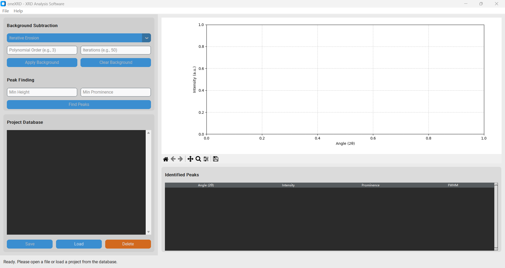
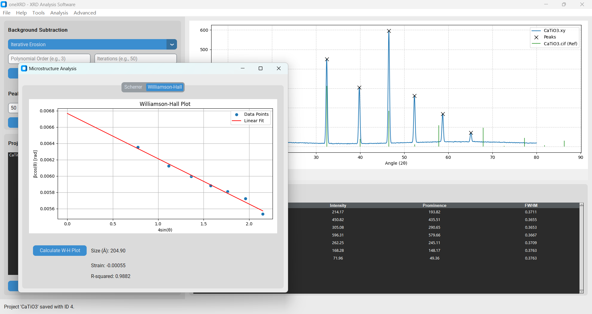

# oneXRD


An intuitive, extensible, and open-source software for powder X-ray Diffraction (XRD) analysis.

oneXRD provides researchers, students, and technicians with a powerful suite of tools to visualize, process, and analyze powder diffraction data without the high cost or steep learning curve of commercial software. Built on a modern Python stack and designed with a modular plugin architecture, oneXRD is both easy to use and ready to grow.

## Key Features

*   **Universal Data Importer:** Load experimental data from a wide variety of formats, including Bruker (`.raw`), PANalytical (`.xrdml`), and generic text files (`.xy`, `.csv`, etc.).
*   **Advanced Analysis Tools:** A complete suite of core analysis functions, including multiple background subtraction methods, robust peak finding, and individual peak fitting.
*   **Project Database:** Save and manage your analysis sessions in a local SQLite database for easy access and organization.
*   **Extensible via Plugins:** The entire application is built on a powerful plugin architecture, allowing for easy expansion with advanced new features.
*   **Included Advanced Plugins:**
    *   **Quantitative Phase Analysis:** A dedicated interface for RIR quantification.
    *   **Microstructure Analysis:** Visualize and calculate crystallite size and strain with Williamson-Hall plots.
    *   **Rietveld Refinement:** A full-featured interface powered by the GSAS-II engine (*requires external installation*).
    *   **Batch Processing:** Automate the analysis of large sets of data files.

## Screenshot



*The main interface of oneXRD, showing the control panel on the left and the plot/results area on the right.*

---

## Installation and Setup

### 1. Prerequisites

*   **Python 3.8+**
*   **Git** for cloning the repository.
*   **(Optional) SVN Client:** Required *only* for the Rietveld Refinement plugin's dependency, GSAS-II.

### 2. Standard Installation

1.  **Clone the repository:**
    ```bash
    git clone https://github.com/little-gt/TOOLS-oneXRD.git
    cd TOOLS-oneXRD
    ```

2.  **Create a virtual environment (recommended):**
    ```bash
    python -m venv .venv
    # On Windows
    .venv\Scripts\activate
    # On macOS/Linux
    source .venv/bin/activate
    ```

3.  **Install the required Python packages:**
    *(Note: A `requirements.txt` file should be created containing the following)*
    ```
    customtkinter
    numpy
    pandas
    matplotlib
    scipy
    pymatgen
    ```
    Install them with pip:
    ```bash
    pip install -r requirements.txt
    ```

### 3. (Optional) Setup for Rietveld Refinement

The Rietveld Refinement plugin depends on the external scientific package **GSAS-II**. To install it, you can run the automated installer script provided in this repository.

*   From the root directory of the project, run:
    ```bash
    python install_gsas2.py
    ```
*   The script will detect your operating system (Windows or Linux) and guide you through the process of installing SVN (if needed) and GSAS-II. Follow the on-screen instructions.

---

## Usage

Once the installation is complete, you can run the application by executing the `oneXRD` package from the project's root directory:

```bash
python -m oneXRD
```

The main application window will appear.

## Core Functionality

#### Loading Data
*   Go to **File > Open File...** to load your experimental data. The file type will be automatically detected.
*   To load a reference pattern for comparison, open a `.cif` file. It will be automatically overlaid on your experimental data.

#### Analysis Workflow



*The control panel provides access to all core analysis tools.*

1.  **Background Subtraction:** Use the dropdown to select a method (e.g., `Iterative Erosion`) and click **Apply Background**.
2.  **Peak Finding:** Enter filter parameters (e.g., `Min Prominence`) and click **Find Peaks**.
3.  Results are instantly shown as markers on the plot and as a detailed table in the **Identified Peaks** list.

## Extending with Plugins

oneXRD's greatest strength is its modularity. The included plugins (Quantitative Analysis, Microstructure Analysis, Rietveld Refinement, Batch Processing) provide advanced capabilities and serve as examples for creating your own tools.

For more information on developing your own plugins, please see the **[Plugin API Documentation](docs/api/README.md)**.

## License

This project is licensed under the **Apache 2.0 License**. See the `LICENSE` file for more details.

## Contributing

Contributions are welcome! If you have ideas for new features, bug fixes, or new plugins, please feel free to open an issue or submit a pull request.

## Acknowledgements

This project is built upon the fantastic work of the open-source scientific Python community. We would like to extend our sincere thanks to the developers of:
*   NumPy
*   SciPy
*   pandas
*   Matplotlib
*   Pymatgen
*   GSAS-II
*   CustomTkinter